# Database Schema

Brainwave EduSys — 17 tables, MySQL 8, managed via Prisma.

> **Keep this file in sync with `apps/backend/prisma/schema.prisma`.** Update whenever a migration is created.
>
> Last updated: 2026-06-25 | Migration: `20260621161949_read_states`

---

## Entity Relationship Diagram

```mermaid
erDiagram
    %% ── Auth & Users ──────────────────────────────────────────

    users {
        int id PK
        string uuid UK
        string name
        string email UK
        string password_hash
        string phone
        string whatsapp_number
        string roll_number
        string department
        string class_name
        int role_id FK
        enum status "ACTIVE|INACTIVE|SUSPENDED"
        json metadata
        datetime created_at
        datetime updated_at
        datetime deleted_at "soft delete"
    }

    roles {
        int id PK
        string name UK
        string display_name
        text description
        bool is_system
        datetime created_at
        datetime updated_at
    }

    permissions {
        int id PK
        string name UK
        string display_name
        string module
        text description
        datetime created_at
    }

    role_permissions {
        int id PK
        int role_id FK
        int permission_id FK
    }

    user_permissions {
        int id PK
        int user_id FK
        int permission_id FK
        bool granted "true=grant, false=revoke"
        int granted_by FK
        datetime created_at
    }

    refresh_tokens {
        int id PK
        int user_id FK
        string token UK
        datetime expires_at
        bool revoked
        string replaced_by
        text user_agent
        string ip_address
        datetime created_at
    }

    %% ── Groups ────────────────────────────────────────────────

    groups {
        int id PK
        string name
        string slug UK
        text description
        enum type "CLASS|DEPARTMENT|CUSTOM"
        enum status "ACTIVE|ARCHIVED"
        int created_by FK
        datetime created_at
        datetime updated_at
        datetime deleted_at "soft delete"
    }

    user_groups {
        int id PK
        int user_id FK
        int group_id FK
        int added_by FK
        datetime created_at
    }

    %% ── Messaging ─────────────────────────────────────────────

    message_campaigns {
        int id PK
        string uuid UK
        string title
        text message_body
        enum channel "WHATSAPP|PUSH|BOTH"
        enum recipient_type "SINGLE|MULTIPLE|GROUP|ALL"
        enum status "PENDING|PROCESSING|SENT|FAILED|PARTIAL_FAILED"
        int total_recipients
        int sent_count
        int failed_count
        datetime scheduled_at
        datetime started_at
        datetime completed_at
        int created_by FK
        datetime created_at
        datetime updated_at
    }

    message_recipients {
        int id PK
        int campaign_id FK
        int user_id FK
        string whatsapp_number
        enum status "PENDING|SENT|FAILED"
        text error_message
        datetime sent_at
        datetime created_at
    }

    message_logs {
        int id PK
        int campaign_id FK
        int recipient_id FK
        string provider
        string provider_message_id
        string status
        json request_payload
        json response_payload
        text error
        datetime created_at
    }

    %% ── Import ────────────────────────────────────────────────

    import_batches {
        int id PK
        string uuid UK
        string filename
        enum file_type "CSV|XLSX"
        int total_rows
        int success_count
        int skipped_count
        int failed_count
        enum status "PENDING|PROCESSING|COMPLETED|FAILED"
        json group_ids
        json errors
        int created_by FK
        datetime created_at
        datetime completed_at
    }

    import_rows {
        int id PK
        int batch_id FK
        int row_number
        json raw_data
        enum status "SUCCESS|SKIPPED|FAILED"
        text error_message
        int user_id "nullable, set on success"
        datetime created_at
    }

    %% ── Web Push ──────────────────────────────────────────────

    push_subscriptions {
        int id PK
        int user_id FK
        text endpoint
        text p256dh
        text auth
        text user_agent
        bool is_active
        datetime created_at
        datetime updated_at
    }

    push_notifications {
        int id PK
        string title
        text body
        string icon
        string url
        json data
        enum recipient_type "SINGLE|MULTIPLE|GROUP|ALL"
        int total_sent
        int total_failed
        int created_by FK
        datetime created_at
    }

    push_notification_recipients {
        int id PK
        int notification_id FK
        int user_id FK
        int subscription_id FK "nullable — in-app notify without OS push"
        enum status "SENT|FAILED"
        bool in_app_read
        bool push_read
        text error_message
        datetime created_at
    }

    %% ── Audit ─────────────────────────────────────────────────

    audit_logs {
        bigint id PK
        int user_id FK "nullable (system actions)"
        string action
        string module
        string target_type
        int target_id
        json old_values
        json new_values
        string ip_address
        text user_agent
        datetime created_at
    }

    %% ── Relationships ─────────────────────────────────────────

    users }o--|| roles : "role_id"
    roles ||--o{ role_permissions : ""
    permissions ||--o{ role_permissions : ""
    users ||--o{ user_permissions : "user_id"
    permissions ||--o{ user_permissions : ""
    users ||--o{ user_permissions : "granted_by"
    users ||--o{ refresh_tokens : "user_id"

    users ||--o{ user_groups : "user_id"
    groups ||--o{ user_groups : "group_id"
    users ||--o{ user_groups : "added_by"
    users ||--o{ groups : "created_by"

    users ||--o{ message_campaigns : "created_by"
    message_campaigns ||--o{ message_recipients : "campaign_id"
    users ||--o{ message_recipients : "user_id"
    message_campaigns ||--o{ message_logs : "campaign_id"
    message_recipients ||--o{ message_logs : "recipient_id"

    users ||--o{ import_batches : "created_by"
    import_batches ||--o{ import_rows : "batch_id"

    users ||--o{ push_subscriptions : "user_id"
    users ||--o{ push_notifications : "created_by"
    push_notifications ||--o{ push_notification_recipients : "notification_id"
    users ||--o{ push_notification_recipients : "user_id"
    push_subscriptions ||--o{ push_notification_recipients : "subscription_id"

    users ||--o{ audit_logs : "user_id"
```

---

## Table Summary

| Table | Rows purpose | Soft delete |
|---|---|---|
| `users` | All system users (students, staff, admin) | `deleted_at` |
| `roles` | System roles: MASTER > ADMIN > MODERATOR > USER | — |
| `permissions` | Named permission strings e.g. `users.view` | — |
| `role_permissions` | Which permissions a role has | — |
| `user_permissions` | Per-user overrides (`granted=true/false`) | — |
| `refresh_tokens` | JWT refresh token rotation store | — |
| `groups` | Student/staff groupings for broadcasts | `deleted_at` |
| `user_groups` | M2M users ↔ groups | — |
| `message_campaigns` | WhatsApp/push broadcast jobs | — |
| `message_recipients` | Per-user send targets for a campaign | — |
| `message_logs` | Raw provider request/response per recipient | — |
| `import_batches` | CSV/XLSX bulk import sessions | — |
| `import_rows` | Per-row result of an import batch | — |
| `push_subscriptions` | Browser Web Push subscription keys | — |
| `push_notifications` | Push broadcast jobs | — |
| `push_notification_recipients` | Per-user push delivery + read state | — |
| `audit_logs` | Append-only mutation audit trail | — |

---

## Key design notes

- **Permission resolution**: effective perms = role perms ∪ user_permissions(granted=true) \ user_permissions(granted=false). MASTER bypasses all checks.
- **`subscription_id` nullable** on `push_notification_recipients` — allows in-app notifications to be created even when user has not granted OS push permission.
- **Separate read states**: `in_app_read` (user opened drawer) vs `push_read` (OS notification clicked/dismissed) tracked independently.
- **`audit_logs.id` is `BIGINT`** — high write volume table; avoids INT overflow.
- **Soft deletes** only on `users` and `groups` — all other deletes are cascade hard-deletes.
